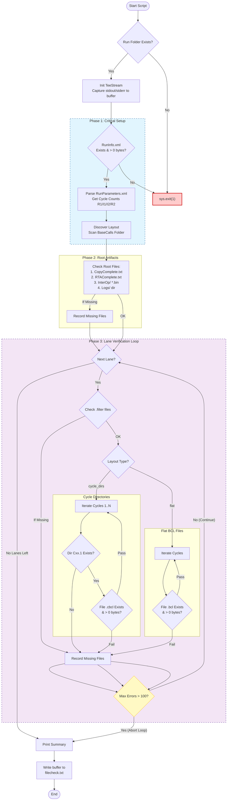

# integrity_check.py – Run Completeness Verification Script

`integrity_check.py` is a new, single source of truth script for validating the presence of expected file content within Illumina (NovaSeq & NextSeq) runfolders. It replaces the older checksum-based helpers and is
designed to be used in combination with Server Message Block signing in existing Samba shares to ensure data integrity after files are transferred from remote sequencer workstations to the local bioinformatics workstations.

## Requirements

| Requirement | Notes |
|-------------|-------|
| Python 3.8+ | Script relies on features introduced in Python 3.8. |
| Read access to the run folder | The directory must contain `RunParameters.xml`, `RunInfo.xml`, and `Data/Intensities/BaseCalls/`. |

No additional packages or configuration files are needed.

## How it works



## Quick start

```bash
python3 integrity_check.py /media/data1/share/251204_A01229_0641_AHGCTNDRX7
```

Point the script at the **run root** (the folder that contains the XML files and
`Data/`). The command:

1. Confirms `RunInfo.xml` exists and is non-empty.
2. Parses `RunParameters.xml` to determine cycle counts for Read 1, both index reads,
   and Read 2.
3. Discovers all lane directories under `Data/Intensities/BaseCalls/`.
4. Builds the list of expected `.cbcl` files by inspecting the filesystem (falling
   back to `RunInfo.xml` tiles if none are present yet).
5. Iterates over every cycle directory (`C<cycle>.1`) and verifies each required file.
6. Generates `filecheck.txt` containing either a **SUCCESS** or **ERROR** string in the Illumina runfolder to be used as a flagfile for automation.

## Sample output

```
Parsing /.../RunParameters.xml...
 - Found Read 1: 151 cycles
 - Found Index 1: 10 cycles
 - Found Index 2: 10 cycles
 - Found Read 2: 151 cycles
 - Discovered Lanes: L001, L002
   Lane L001: 312 .filter files discovered (e.g., s_1_1101.filter)
   Lane L001: 2 .cbcl files discovered in C1.1 (e.g., L001_1.cbcl)
   Lane L002: 312 .filter files discovered (e.g., s_2_1101.filter)
   Lane L002: 2 .cbcl files discovered in C1.1 (e.g., L002_1.cbcl)

Starting file verification...
  Completion flag detected: CopyComplete.txt
  InterOp verified: found non-empty EventMetricsOut.bin
  Logs directory present: /.../Logs
Verifying Lane: L001
Verifying Lane: L002

--- Verification Summary ---
Total files checked: 1917
Total files missing: 0

SUCCESS: The run appears to be complete.
```

If files are missing, the script prints representative paths (`MISSING`, `EMPTY`,
or `ERROR accessing`) and reports when the `MAX_ERRORS` threshold (100) is hit.

## Exit behaviour

- **Fatal setup issues** (missing XML, unreadable directories, no lanes/tiles)
  trigger `sys.exit(1)` with an explanatory message.
- **Verification failures** (missing CBCL/filter files) do **not** change the exit
  code, but the summary prints `ERROR: N expected files are missing.` so automation
  should treat any non-zero missing count as a hard failure.

## Troubleshooting checklist

| Symptom | Likely cause / next step |
|---------|-------------------------|
| `RunInfo.xml not found` | Verify the run has finished transferring from the sequencer. |
| `No lane directories (e.g., L001)` | You may have pointed at the wrong folder or BaseCalls has not been created yet. |
| `.filter verification skipped` | Informational only; some runs legitimately lack filter files. |
| Immediate `Too many errors detected` | Usually indicates the `C*.1` directories are absent for a lane. Confirm the copy or re-transfer. |
